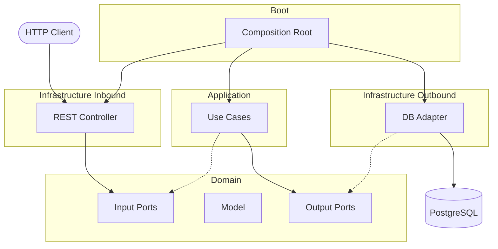

# Hexagonal Architecture - Java Project

This is a production-ready example project implementing **hexagonal architecture** (ports and adapters pattern) using **Java** and **Spring Boot** with **PostgreSQL**.

## 📋 Description

Hexagonal architecture advocates for separation of concerns, enhancing code maintainability and testability. This project demonstrates a comprehensive implementation with:

- **Domain Layer**: Pure business logic independent of frameworks
- **Application Layer**: Use cases and business orchestration  
- **Infrastructure Layer**: REST adapters (inbound) and database adapters (outbound)
- **Boot Module**: Spring Boot configuration and dependency injection

## 🏗️ Project Structure

The project is organized into Maven modules plus deployment resources:

```
hexagonal/
├── code/
│   ├── domain/                      # Pure business logic
│   ├── application/                 # Use cases & application services
│   ├── infrastructure/
│   │   ├── inbound/
│   │   │   └── rest/               # REST controllers + OpenAPI contracts
│   │   └── outbound/
│   │       └── database/           # JPA repositories & entities
│   └── boot/                       # Spring Boot main application
├── e2e/
│   └── karate/                     # End-to-end API tests (Karate + JUnit 5)
└── deployment/
    └── docker/                   # Compose + postgres init scripts
```

## 🔄 Module Communication



> `-->` calls &nbsp;&nbsp; `- - ->` implements

If the diagram is still not rendered in VS Code preview, enable Mermaid support in Markdown preview settings or use a Mermaid preview extension.

## 🚀 Quick Start

### 1. Start PostgreSQL
```bash
cd deployment/docker
docker compose up -d
```

### 2. Build & Run
```bash
cd code
mvn clean install
cd boot
mvn spring-boot:run
```

Application available at: **http://localhost:8080/api**

## 📚 Modules

### Domain
Contains business entities and the core business logic. This module is independent of any framework.

**Content:**
- Domain entities
- Repository interfaces (ports)
- Commands/queries and domain exceptions

### Application
Implements the application use cases using domain ports.

**Content:**
- Application services
- Use case implementations
- Transactional orchestration over domain ports

### Infrastructure

#### Inbound (REST)
Inbound adapters that expose the REST API.

**Features:**
- REST Controllers
- OpenAPI/Swagger documentation with contract-first approach
- Automatic code generation from OpenAPI specifications
- OpenAPI contracts under `src/main/resources/contract/`

**Available Resources:**
- `/api/users` - User-related operations

#### Outbound (Database)
Outbound adapters for data persistence using **PostgreSQL**.

**Content:**
- JPA Repository implementations
- Entity mapping and data access layer
- Database schema management with Hibernate

### Boot
Boot module that configures the Spring Boot application and includes all necessary dependencies.

**Content:**
- Main application class (`Application.java`)
- Configuration composition by importing REST and Database config files
- Spring component scanning and auto-configuration

## 🔌 Ports and Adapters

### Ports (Interfaces)
Ports are defined as interfaces that represent contracts between the domain and the outside world.

### Adapters
Adapters are concrete implementations of ports:
- **REST Adapter**: Converts HTTP requests into application commands
- **Database Adapter**: Persists data in PostgreSQL using JPA/Hibernate

## 📖 API Documentation

Once the application is running, access the interactive API documentation:
- **Swagger UI**: http://localhost:8080/api/swagger-ui/index.html
- **OpenAPI JSON**: http://localhost:8080/api/v3/api-docs
- **Redoc**: http://localhost:8080/api/redoc.html

The API uses **OpenAPI 3.0** specification with contract-first approach defined in `code/infrastructure/inbound/rest/src/main/resources/contract/`

## 🧪 Testing

### Unit Tests
```bash
cd code
mvn test
```

### Integration Tests
```bash
cd code
mvn verify
# or specifically
mvn failsafe:integration-test
```

The project includes:
- **Unit Tests** (`src/test/java`): Fast, isolated business logic tests
- **Integration Tests** (`src/test-integration/java`): Database and API layer integration tests
- **Test Utils** (`src/test-utils/java`): Shared builders and reusable test helpers

### E2E Tests (Karate)

Karate tests are in `e2e/karate` and can run in 3 modes using `executionMode`:

- **all** (default): runs the complete suite
- **smoke**: runs only smoke-tagged tests (currently full E2E flow)
- **features**: runs feature tests excluding smoke-tagged ones

```bash
# Default (all)
mvn -f e2e/karate/pom.xml clean test

# Smoke only
mvn -f e2e/karate/pom.xml clean test -DexecutionMode=smoke

# Feature suite excluding smoke
mvn -f e2e/karate/pom.xml clean test -DexecutionMode=features
```

You can override the API base URL if needed:

```bash
mvn -f e2e/karate/pom.xml clean test -DbaseUrl=http://localhost:8080/api
```

#### Error Contract Consolidation

`404` non-existing-user contract checks were consolidated into a dedicated feature:

- `e2e/karate/src/test/resources/features/users/users-error-contract.feature`

This keeps endpoint features focused on happy paths and centralizes negative contract validation.

## 📝 Configuration

Application configuration is organized by concerns:

- **Main**: `code/boot/src/main/resources/application.yml` - Composition layer
- **REST**: `code/infrastructure/inbound/rest/src/main/resources/application-rest.yml` - API configuration
- **Database**: `code/infrastructure/outbound/database/src/main/resources/application-database.yml` - Persistence configuration

**Created as an example of Hexagonal Architecture in Java** 🏗️
