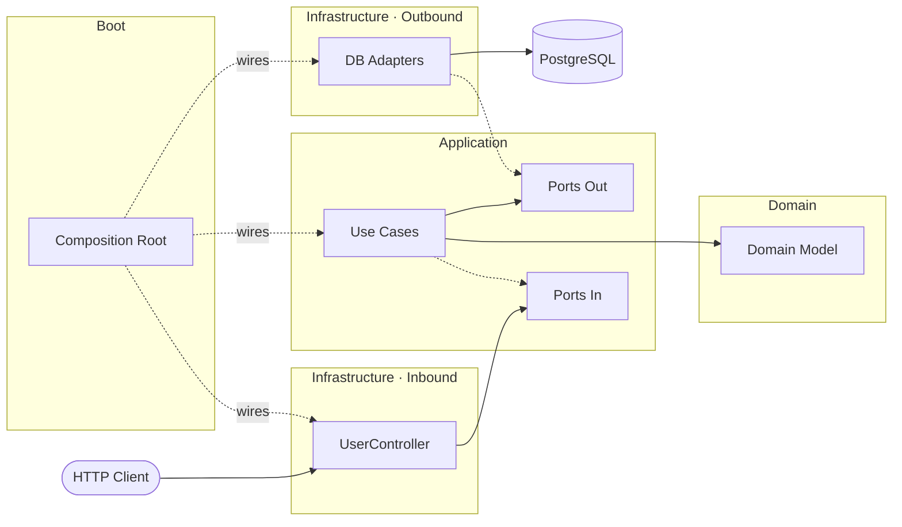

# Hexagonal Architecture - Java Project

This is a production-ready example project implementing **hexagonal architecture** (ports and adapters pattern) using **Java** and **Spring Boot** with **PostgreSQL**.

## 📋 Description

This repository is a practical implementation of **Hexagonal Architecture (Ports & Adapters)** in a **multi-module Maven** setup.

The goal is to keep the business core isolated from frameworks and infrastructure concerns, making the codebase easier to evolve, test, and maintain over time.

It is organized around four main modules:

- **Domain**: business model and core rules, framework-agnostic
- **Application**: use cases and port contracts that orchestrate the domain
- **Infrastructure**: inbound REST adapters and outbound database adapters
- **Boot**: Spring Boot composition root and runtime wiring

The API follows a **contract-first** approach with OpenAPI, includes unit/integration/E2E testing, and is prepared to run with PostgreSQL via Docker Compose.

## 🏗️ Project Structure

The project is organized into Maven modules plus deployment resources:

```
Hexagonal-BE/
├── code/
│   ├── pom.xml                      # Parent Maven module
│   ├── domain/                      # Domain layer
│   ├── application/                 # Application layer (use cases + ports)
│   ├── infrastructure/
│   │   ├── inbound/
│   │   │   └── rest/                # REST adapter + OpenAPI contracts
│   │   └── outbound/
│   │       └── database/            # Database adapter (JPA/PostgreSQL)
│   ├── boot/                        # Spring Boot main application
├── e2e/
│   └── karate/                      # End-to-end API tests (Karate + JUnit 5)
└── deployment/
    └── docker/                     # Docker Compose + Postgres init scripts
```

## 🔄 Module Communication



> `-->` runtime flow &nbsp;&nbsp; `-.->` implementation/wiring

## 🚀 Quick Start

### 1. Start PostgreSQL
```bash
cd deployment/docker
docker compose up -d
```

### 2. Build & Run
```bash
cd code
mvn clean install
cd boot
mvn spring-boot:run
```

Application available at: **http://localhost:8080/api**

## 📚 Modules

### Domain
Contains the business model and core rules. This module is framework-agnostic and does not depend on Spring.

**Content:**
- Entities and value objects
- Domain services/factories
- Domain exceptions and error messages

### Application
Implements use cases and defines the contracts (ports) to interact with infrastructure.

**Content:**
- Ports In (input contracts for inbound adapters)
- Ports Out (output contracts for outbound adapters)
- Commands and queries for use case execution
- Use case implementations and orchestration

### Infrastructure
Provides adapter implementations for external interaction.

#### Inbound (REST)
Exposes the API and translates HTTP requests/responses to application use cases.

**Features:**
- REST controllers
- OpenAPI contract-first documentation
- API code generation from OpenAPI specs
- Centralized REST exception handling

**Contract location:**
- `code/infrastructure/inbound/rest/src/main/resources/contract/`

#### Outbound (Database)
Implements persistence with PostgreSQL using Spring Data JPA.

**Content:**
- Repository adapters implementing Ports Out
- JPA repositories and DAO mappings
- Persistence configuration and data access

### Boot
Application composition root that wires all modules and launches Spring Boot.

**Content:**
- Main application entrypoint
- Component scanning and module wiring
- Runtime configuration composition

## 🔌 Ports and Adapters

### Ports (Interfaces)
Ports are contracts defined in the application layer to decouple use cases from external technologies.

- **Ports In**: define how the application is invoked (input boundary for use cases)
- **Ports Out**: define what external capabilities the application needs (output boundary)

### Adapters
Adapters are infrastructure implementations that connect external systems to ports:

- **Inbound adapters** (for example REST): translate external requests into calls to **Ports In**
- **Outbound adapters** (for example database): implement **Ports Out** to persist and retrieve data

This separation keeps business logic independent from HTTP, database, and framework details.

## 📖 API Documentation

Once the application is running, you can access the interactive API documentation:
- **Swagger UI**: http://localhost:8080/api/swagger-ui/index.html
- **OpenAPI JSON**: http://localhost:8080/api/v3/api-docs
- **Redoc**: http://localhost:8080/api/redoc.html

The API follows an **OpenAPI 3.0 contract-first** approach.
Contracts are defined in `code/infrastructure/inbound/rest/src/main/resources/contract/`.

## 🧪 Testing

### Unit Tests
```bash
cd code
mvn test
```

### Integration Tests
```bash
cd code
mvn verify
```

The project includes:
- **Unit Tests** (`src/test/java`): Fast, isolated business logic tests
- **Integration Tests** (`src/test-integration/java`): Database and API layer integration tests
- **Test Utils** (`src/test-utils/java`): Shared builders and reusable test helpers

### E2E Tests (Karate)

Karate tests are in `e2e/karate` and can run in 3 modes using `executionMode`:

- **all** (default): runs the complete suite
- **smoke**: runs only smoke-tagged tests (currently full E2E flow)
- **features**: runs feature tests excluding smoke-tagged ones

```bash
# Default (all)
mvn -f e2e/karate/pom.xml clean test

# Smoke only
mvn -f e2e/karate/pom.xml clean test -DexecutionMode=smoke

# Feature suite excluding smoke
mvn -f e2e/karate/pom.xml clean test -DexecutionMode=features
```

Optional: override the API base URL if needed:

```bash
mvn -f e2e/karate/pom.xml clean test -DbaseUrl=http://localhost:8080/api
```

#### Error Contract Consolidation

`404` non-existing-user contract checks were consolidated into a dedicated feature:

- `e2e/karate/src/test/resources/features/users/users-error-contract.feature`

This keeps endpoint features focused on happy paths and centralizes negative contract validation.

## 📝 Configuration

Application configuration is organized by concerns:

- **Main**: `code/boot/src/main/resources/application.yml` - Composition layer
- **REST**: `code/infrastructure/inbound/rest/src/main/resources/application-rest.yml` - API configuration
- **Database**: `code/infrastructure/outbound/database/src/main/resources/application-database.yml` - Persistence configuration

**Built as a practical Hexagonal Architecture example in Java.**
