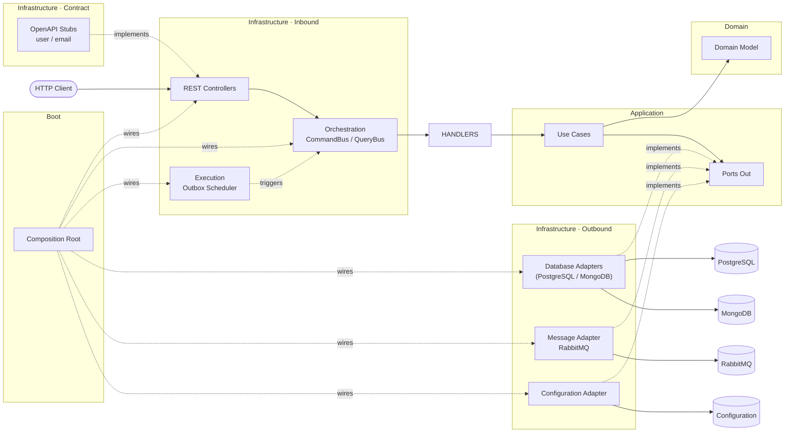

# Hexagonal Architecture - Java Project

This is a production-ready example project implementing **hexagonal architecture** (ports and adapters pattern) using **Java** and **Spring Boot** with **PostgreSQL**.

## 📋 Description

This repository is a practical implementation of **Hexagonal Architecture (Ports & Adapters)** in a **multi-module Maven** setup.

The goal is to keep the business core isolated from frameworks and infrastructure concerns, making the codebase easier to evolve, test, and maintain over time.

It is organized around four main modules:

- **Domain**: business model and core rules, framework-agnostic
- **Application**: use cases and port contracts that orchestrate the domain
- **Infrastructure**: contract stubs, inbound REST adapters, and outbound database/messaging/configuration adapters
- **Boot**: Spring Boot composition root and runtime wiring

The API follows a **contract-first** approach with OpenAPI, includes unit/integration/E2E testing, and is prepared to run with PostgreSQL via Docker Compose.

## 🏗️ Project Structure

The project is organized as a multi-module Maven workspace with deployment resources:

```
Hexagonal-BE/
├── code/
│   ├── pom.xml                      # Parent module
│   ├── domain/                      # Domain model (entities, VOs, services)
│   ├── application/                 # Use cases, business slices, ports
│   │   └── src/
│   │       └── main/java/com/architecture/hexagonal/application/
│   │           ├── business/                # Business slices (user, email, ...)
│   │           │   └── <feature>/           # e.g. user, email
│   │           │       └── <action>/        # e.g. create, getall, update, patch, delete
│   │           │           ├── command/     # Commands & handlers (CQRS)
│   │           │           ├── query/       # Queries & handlers (CQRS)
│   │           │           ├── port/        # Ports In/Out for the use case
│   │           │           └── usecase/     # Use case logic
│   │           ├── technical/               # Technical use cases (infrastructure patterns)
│   │           │   └── outbox/              # Outbox event processing
│   │           │       ├── block/           # Block/suspend event processing
│   │           │       ├── find/            # Find pending events
│   │           │       └── process/         # Process and publish events
│   │           └── port/                    # Shared ports (e.g. configuration, database)
│   ├── infrastructure/
│   │   ├── contract/
│   │   │   └── rest/                # OpenAPI server stubs (user / email)
│   │   ├── inbound/
│   │   │   ├── orchestration/       # CQRS buses (CommandBus, QueryBus)
│   │   │   ├── execution/           # Schedulers (Outbox polling)
│   │   │   └── rest/                # REST controllers implementation
│   │   └── outbound/
│   │       ├── database/
│   │       │   ├── postgresql/      # DB adapters (JPA/PostgreSQL)
│   │       │   └── mongodb/         # DB adapters (MongoDB/Outbox events)
│   │       ├── message/
│   │       │   └── rabbitmq/        # Messaging adapters (RabbitMQ)
│   │       └── configuration/       # Config adapters (application.yml rules)
│   └── boot/                        # Spring Boot composition root
├── e2e/
│   └── karate/                      # End-to-end API tests (Karate)
└── deployment/
    └── docker/                      # Docker Compose + Postgres init SQL
```

## 🔄 Module Communication


```mermaid
flowchart LR
    Client([HTTP Client])
    POSTGRES[(PostgreSQL)]
    MONGO[(MongoDB)]
    RABBIT[(RabbitMQ)]
    Config[(Configuration)]

    subgraph CONTRACT["Infrastructure · Contract"]
        direction TB
        OAS[OpenAPI Stubs\nuser / email]
    end

    subgraph INBOUND["Infrastructure · Inbound"]
        direction TB
        REST[REST Controllers]
        ORCH[Orchestration\nCommandBus / QueryBus]
        EXEC[Execution\nOutbox Scheduler]
    end

    subgraph APP["Application"]
        direction TB
        UC[Use Cases]
        POUT[Ports Out]
    end

    subgraph DOMAIN["Domain"]
        direction TB
        MODEL[Domain Model]
    end

    subgraph OUTBOUND["Infrastructure · Outbound"]
        direction TB
        DB["Database Adapters\n(PostgreSQL / MongoDB)"]
        MSG[Message Adapter\nRabbitMQ]
        CFG[Configuration Adapter]
    end

    subgraph BOOT["Boot"]
        direction TB
        COMP[Composition Root]
    end

    OAS -.implements.-> REST
    Client --> REST
    REST --> ORCH
    ORCH --> HANDLERS
    HANDLERS --> UC
    UC --> MODEL
    UC --> POUT
    DB -.implements.-> POUT
    MSG -.implements.-> POUT
    CFG -.implements.-> POUT
    
    DB --> POSTGRES
    DB --> MONGO
    MSG --> RABBIT
    EXEC -.triggers.-> ORCH
    CFG --> Config

    COMP -.wires.-> REST
    COMP -.wires.-> ORCH
    COMP -.wires.-> EXEC
    COMP -.wires.-> DB
    COMP -.wires.-> MSG
    COMP -.wires.-> CFG
```

> `-->` runtime flow &nbsp;&nbsp; `-.->` implementation/wiring

## 🚀 Quick Start

### 1. Start infrastructure
```bash
cd deployment/docker
docker compose up -d
```

This starts **PostgreSQL** (port 5432) and **RabbitMQ** (ports 5672 / 15672).

### 2. Build & Run
```bash
cd code
mvn clean install
cd boot
mvn spring-boot:run
```

Application available at: **http://localhost:8080/api**

## 📚 Modules

### Domain
Framework-agnostic module containing the core business model. Has no Spring dependency.

**Content:**
- Entities and value objects
- Domain services and factories
- Predicates for domain rules
- Domain exceptions

### Application
Orchestrates the domain through use cases and defines the port contracts consumed by infrastructure.

**Content:**
- Business use cases for User CRUD and email rules retrieval
- Business slices organized by domain features
- Technical use cases for infrastructure patterns (Outbox event processing)
- Ports In — one input contract per use case
- Ports Out — contracts for persistence and configuration access
- `CommandBus` / `QueryBus` dispatchers and their handler implementations

### Infrastructure

#### Contract — REST (`code/infrastructure/inbound/contract/rest`)
Holds the OpenAPI 3.0 specifications and generates server-side stubs consumed by the inbound controllers.

**Content:**
- `inbound-user-rest-server`: OpenAPI spec for the User API
- `inbound-email-rest-server`: OpenAPI spec for the Email rules API
- Generated Java interfaces implemented by REST controllers

#### Inbound — Orchestration (`code/infrastructure/inbound/orchestration`)
Implements CQRS buses for command and query orchestration.

**Content:**
- `CommandBus` and `QueryBus` implementations
- Command/Query handler registration and dispatching

#### Inbound — Execution (`code/infrastructure/inbound/execution`)
Manages scheduled tasks and event processing workflows.

**Content:**
- Outbox event polling scheduler with configurable retry policies
- Scheduler configuration and Spring scheduling integration

#### Inbound — REST (`code/infrastructure/inbound/rest`)
Exposes the HTTP API and translates requests into application commands/queries.

**Content:**
- REST controllers implementing the generated OpenAPI interfaces
- MapStruct mappers: `UserToRestMapper`, `UserFromRestMapper` (following `[Entity][From/To][Module]Mapper` naming convention)
- Centralized REST exception handling

#### Outbound — Database (`code/infrastructure/outbound/database`)
Implements persistence with PostgreSQL and MongoDB through modular adapters.

**Modules:**
- **PostgreSQL** (`postgresql/`): User data persistence with Spring Data JPA
  - Repository adapters implementing Ports Out
  - MapStruct mappers: `UserFromPostgresqlMapper`, `UserToPostgresqlMapper`
  - Persistence configuration and data access

- **MongoDB** (`mongodb/`): Outbox event storage for reliable message publishing
  - Outbox event repositories (read/write)
  - MapStruct mappers: `OutboxDaoMapper`, `OutboxDoFromMongodbMapper`
  - Outbox configuration

**Content:**
- Data access abstractions for domain persistence
- Database-specific adapters and configurations

#### Outbound — Message (`code/infrastructure/outbound/message`)
Publishes domain events to external messaging systems.

**Modules:**
- **RabbitMQ** (`rabbitmq/`): Publishes domain events via Spring Cloud Stream
  - `UserSenderAdapter` implementing the message Port Out
  - Domain event DTOs: `UserCreated`, `UserUpdated`, `UserDeleted`
  - MapStruct mapper: `UserToRabbitmqMapper`
  - RabbitMQ configuration and bindings

**Content:**
- Messaging adapters implementing Ports Out
- Event serialization and routing

#### Outbound — Configuration (`code/infrastructure/outbound/configuration`)
Implements configuration-driven business rules loaded from `application.yml`.

**Content:**
- Repository adapters implementing Ports Out
- Configuration reader for email block-rules

### Boot
Application composition root that wires all modules and launches Spring Boot.

**Content:**
- Main application entrypoint
- Component scanning and module wiring
- Runtime configuration composition

## 🔌 Ports and Adapters

### Ports (Interfaces)
Ports are contracts defined in the application layer to decouple use cases from external technologies.

- **Ports In**: define how the application is invoked (input boundary for use cases)
- **Ports Out**: define what external capabilities the application needs (output boundary)

### Adapters
Adapters are infrastructure implementations that connect external systems to ports:

- **Inbound adapters** (for example REST): translate external requests into calls to **Ports In**
- **Outbound adapters** (for example database): implement **Ports Out** to persist and retrieve data

MapStruct mappers follow a consistent naming pattern: `[Entity][From/To][Module]Mapper`, where:
- `From[Module]` indicates data flowing from the module's infrastructure to the domain
- `To[Module]` indicates data flowing from the domain to the module's infrastructure

This separation keeps business logic independent from HTTP, database, and framework details.

## 📖 API Documentation

Once the application is running, you can access the interactive API documentation:
- **Swagger UI**: http://localhost:8080/api/swagger-ui/index.html
- **OpenAPI JSON**: http://localhost:8080/api/v3/api-docs
- **Redoc**: http://localhost:8080/api/redoc.html

The API follows an **OpenAPI 3.0 contract-first** approach.
Contracts are defined in `code/infrastructure/inbound/contract/rest/`.

## 🧪 Testing

### Unit Tests
```bash
cd code
mvn test
```

### Integration Tests
```bash
cd code
mvn verify
```

The project includes:
- **Unit Tests** (`src/test/java`): Fast, isolated business logic tests
- **Integration Tests** (`src/test-integration/java`): Database and API layer integration tests
- **Test Utils** (`src/test-utils/java`): Shared builders and reusable test helpers

### E2E Tests (Karate)

Karate tests are in `e2e/karate` and can run in 3 modes using `executionMode`:

- **all** (default): runs the complete suite
- **smoke**: runs only smoke-tagged tests (currently full E2E flow)
- **features**: runs feature tests excluding smoke-tagged ones

```bash
# Default (all)
mvn -f e2e/karate/pom.xml clean test

# Smoke only
mvn -f e2e/karate/pom.xml clean test -DexecutionMode=smoke

# Feature suite excluding smoke
mvn -f e2e/karate/pom.xml clean test -DexecutionMode=features
```

Optional: override the API base URL if needed:

```bash
mvn -f e2e/karate/pom.xml clean test -DbaseUrl=http://localhost:8080/api
```

#### Error Contract Consolidation

`404` non-existing-user contract checks were consolidated into a dedicated feature:

- `e2e/karate/src/test/resources/features/users/users-error-contract.feature`

This keeps endpoint features focused on happy paths and centralizes negative contract validation.

## 📝 Configuration

Application configuration is organized by concerns:

- **Main**: `code/boot/src/main/resources/application.yml` - Composition layer
- **REST**: `code/infrastructure/inbound/rest/src/main/resources/application-restserver.yml` - API configuration
- **Execution**: `code/infrastructure/inbound/execution/outbox/src/main/resources/application-execution.yml` - Scheduler configuration
- **Database**: `code/infrastructure/outbound/database/postgresql/src/main/resources/application-postgresql.yml` - PostgreSQL persistence
- **Database**: `code/infrastructure/outbound/database/mongodb/src/main/resources/application-mongodb.yml` - MongoDB persistence (Outbox events)
- **Message**: `code/infrastructure/outbound/message/rabbitmq/src/main/resources/application-rabbitmq.yml` - RabbitMQ / Spring Cloud Stream bindings
- **Configuration**: `code/infrastructure/outbound/configuration/src/main/resources/application-configuration.yml` - Email block rules and scheduler policies

**Built as a practical Hexagonal Architecture example in Java.**
